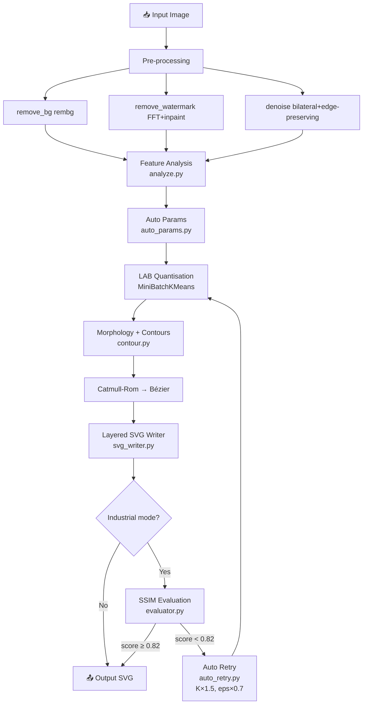

# auto-raster2svg

**工业级彩色位图 → Adobe Illustrator 可编辑 SVG 自动矢量化管线**  
**Industrial-grade automatic raster-to-SVG vectorization pipeline**

[](LICENSE)
[](https://www.python.org/)

---

## ✨ 特性 / Features

| 🇨🇳 中文 | 🇬🇧 English |
|---|---|
| **零调参** — 任何图片直接跑，自动分析最佳参数 | **Zero tuning** — drop any image in; optimal params auto-selected |
| **分层 SVG** — 每颜色一个 `<g>` 图层，AI 直接可编辑 | **Layered SVG** — one `<g>` per colour, directly editable in Illustrator |
| **质量自评** — SSIM 不达标自动重试（最多 3 次） | **Quality gate** — SSIM-gated auto-retry, up to 3 attempts |
| **支持批处理** — `ProcessPoolExecutor` 多进程并行 | **Batch mode** — multi-process parallel via `ProcessPoolExecutor` |
| **预处理管线** — 可选去背景、去水印、保边去噪 | **Pre-processing** — optional bg-remove, watermark removal, denoising |
| **Gradio GUI** — 本地拖拽界面，无需命令行 | **Gradio GUI** — local drag-and-drop web UI |
| **Docker 就绪** — 一键构建 | **Docker-ready** — single `docker build` |

---

## 📦 安装 / Installation

```bash
git clone https://github.com/ww3398354-jpg/auto-raster2svg.git
cd auto-raster2svg
pip install -r requirements.txt
```

可选 extras（SAM2 分割 / LPIPS 评分）：

```bash
pip install segment-anything   # SAM2 支持
```

---

## 🚀 快速上手 / Quick Start

```bash
# 单张图片（全自动）/ Single image (fully automatic)
python -m src.cli input.png output.svg

# 批处理文件夹 / Batch folder
python -m src.cli ./imgs ./svgs --workers 4

# 只输出轮廓线 / Stroke-only (outline) mode
python -m src.cli input.png output.svg --stroke

# 工业模式（质量重试）/ Industrial mode (quality retry)
python -m src.cli input.png output.svg --industrial

# 关闭可选预处理 / Disable optional pre-processing (already off by default)
python -m src.cli input.png output.svg
```

### Gradio GUI

```bash
python gui/gradio_app.py
# 打开浏览器访问 http://127.0.0.1:7860
```

### Docker

```bash
docker build -t raster2svg .
docker run -v $(pwd)/data:/data raster2svg /data/in.png /data/out.svg
```

---

## 🎛️ 参数说明 / CLI Options

| 参数 / Option | 默认 / Default | 说明 / Description |
|---|---|---|
| `input` | — | 输入图片或文件夹 / Input image or directory |
| `output` | — | 输出 SVG 或文件夹 / Output SVG or directory |
| `--stroke` | off | 仅轮廓线，不填色 / Stroke-only, no fill |
| `--industrial` | off | 启用 SSIM 质量重试 / Enable SSIM quality retry |
| `--bg-remove` | off | 启用背景去除 / Enable background removal |
| `--no-bg-remove` | — | 关闭背景去除（默认关）/ Disable bg removal (default) |
| `--watermark` | off | 启用水印去除 / Enable watermark removal |
| `--no-watermark` | — | 关闭水印去除（默认关）/ Disable watermark removal (default) |
| `--workers N` | 1 | 并行进程数（批处理）/ Parallel workers (batch) |
| `--report path` | `report.json` | 报告输出路径 / Report output path |

---

## 🗺️ 管线图 / Pipeline Diagram



---

## 🏗️ 仓库结构 / Repository Structure

```
auto-raster2svg/
├── README.md
├── requirements.txt
├── Dockerfile
├── .gitignore
├── LICENSE
├── config/
│   └── default.yaml
├── src/
│   ├── cli.py
│   ├── pipeline.py
│   ├── preprocess/
│   │   ├── remove_bg.py
│   │   ├── remove_watermark.py
│   │   └── denoise.py
│   ├── segment/
│   │   └── sam_segmenter.py
│   ├── vectorize/
│   │   ├── analyze.py
│   │   ├── auto_params.py
│   │   ├── quantize.py
│   │   ├── contour.py
│   │   └── svg_writer.py
│   ├── quality/
│   │   ├── evaluator.py
│   │   └── auto_retry.py
│   └── utils/
│       └── io.py
├── tests/
│   └── test_pipeline.py
├── gui/
│   └── gradio_app.py
└── examples/
    └── README.md
```

---

## ❓ FAQ

**Q: 如何镜像到 Gitee？ / How to mirror to Gitee?**  
登录 Gitee → 右上角 **"+"** → **从 GitHub 导入仓库** → 粘贴本仓库 URL 即可。

**Q: 为什么 SAM2 是可选的？**  
SAM2 需要下载大型权重文件，主流程不依赖它。只需安装 `segment-anything` 即可启用。

**Q: SSIM 阈值可以调整吗？**  
可以在 `config/default.yaml` 中修改 `quality.ssim_threshold`（默认 0.82）。

**Q: 输出 SVG 如何在 Illustrator 打开？**  
直接将 `.svg` 文件拖入 Illustrator 窗口，或通过 **文件 → 打开**。每个颜色区域是独立的可选图层。

---

## 📜 License

[MIT](LICENSE) © 2024 auto-raster2svg contributors